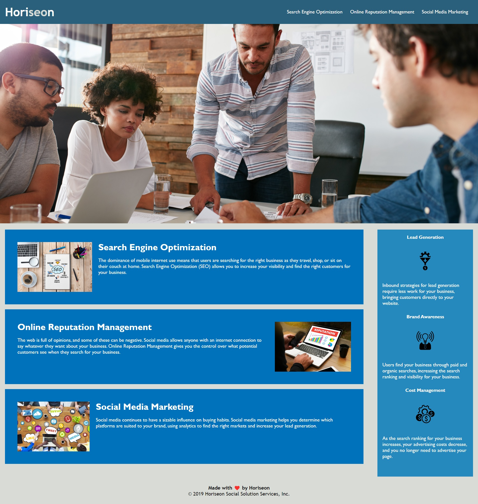

# Challenge-01 Ryan Charleson

## Purpose for This Challenge

The purpose for this challenge is to revise a webpage so that it better follows accessibility standards.

## Issues found within the HTML

1) The ```<div>``` element was used too frequently to separate sections of the codebase.
2) The ```<ul>``` was broken into many lines, thus making it less accessible.

         <ul>
                <li>
                    <a href="#search-engine-optimization">Search Engine Optimization</a>
                </li>
                <li>
                    <a href="#online-reputation-management">Online Reputation Management</a>
                </li>
                <li>
                    <a href="#social-media-marketing">Social Media Marketing</a>
                </li>
            </ul>

## Changes Made to the HTML

```<article>``` was used where ```<div>``` had been placed to separate company services.
```<section>``` was used where ```<div>``` had been placed to label benefits of company services.
```<aside>``` was used where ```<div>``` had been placed to better display orientation of benefits.


## Issues found within the CSS

1) Classes "benefit-lead", "benefit-brand", and "benefit-cost" each had the same color assigned to them as opposed to using the parent class "benefits" to define the color.
2) Styles regarding the services of the company were listed after the benefits of the services which does not match the order of the HTML.

## Changes Made to the CSS

```color: #ffffff``` was removed from ```benefit-lead```, ```benefit-brand```, and ```benefit-cost``` and reassigned to the parent class of ```benefits```.

Styling regarding the ```<article>``` portion was moved to better associate with the order in which it appears in the HTML.

## Mock-Up

The following image shows the web application's appearance. 

